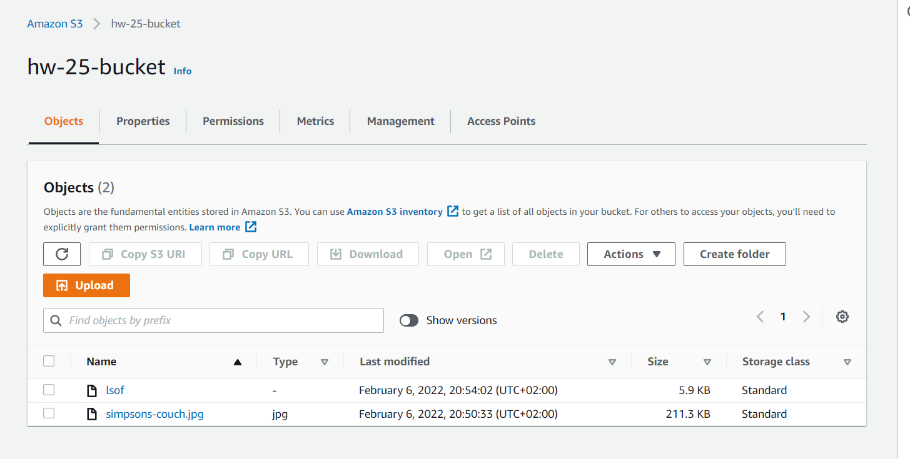
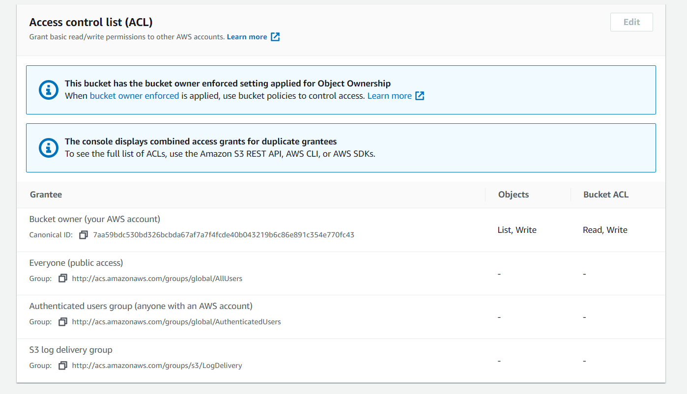
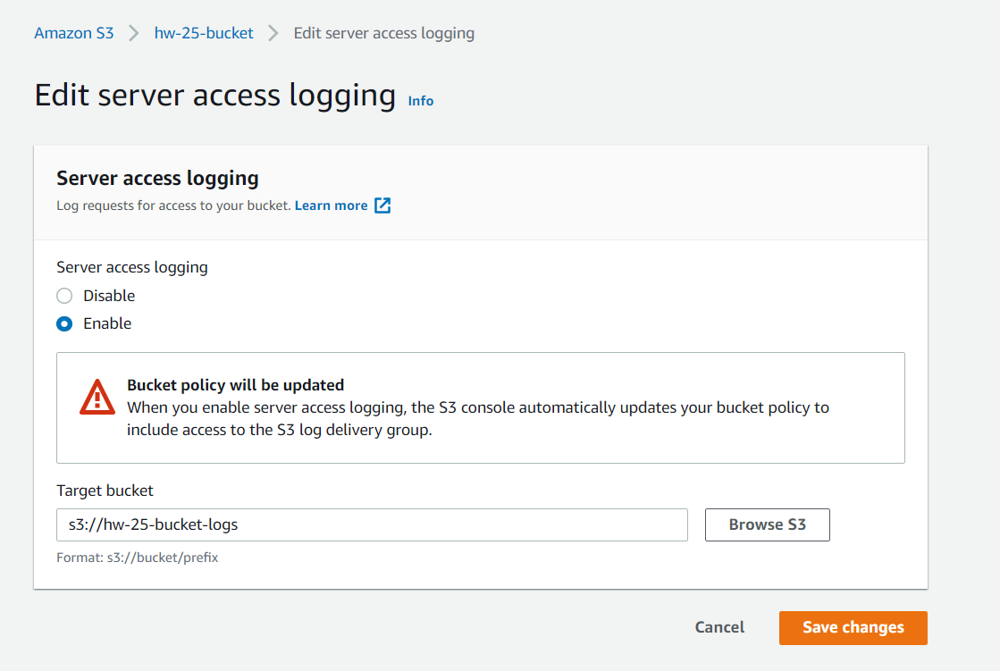
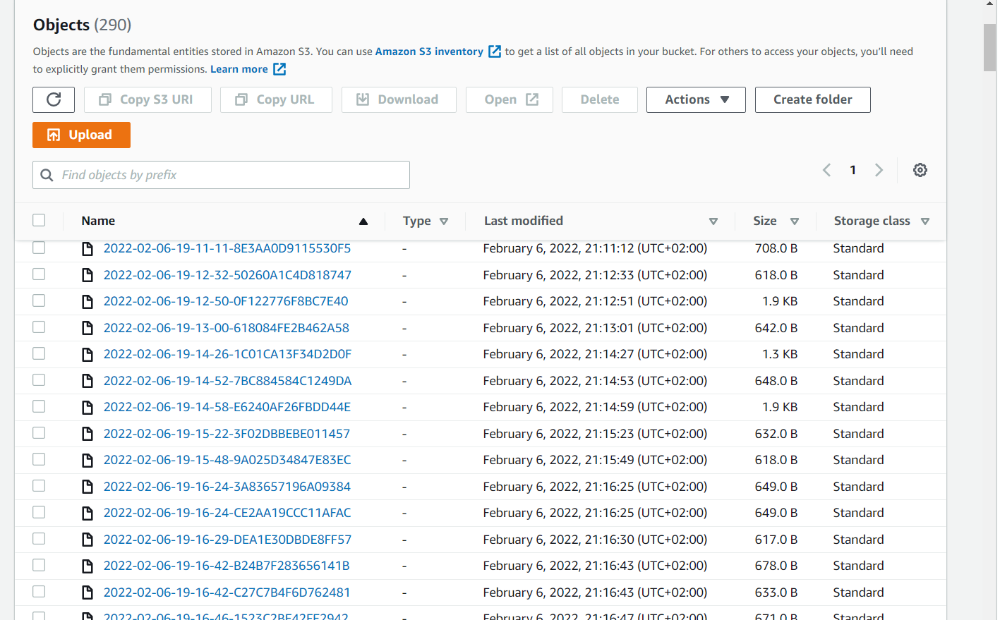

# highload-sw-arch-hw-25

## 1. Create bucket + bucket for logs

## 2. Set up following permissions

## 3. Set up server access logging with new bucket

## 4. On uploading file, logs are pushed to new bucket

